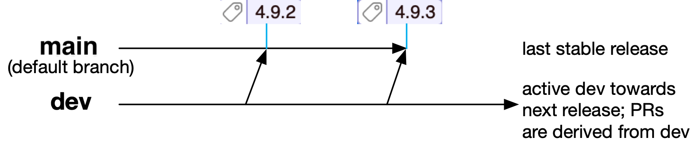

# ANTLR v5

**ANTLR** (ANother Tool for Language Recognition) is a powerful parser generator for reading, processing, executing, or translating structured text or binary files. It's widely used to build languages, tools, and frameworks. From a grammar, ANTLR generates a parser that can build parse trees and also generates a listener interface (or visitor) that makes it easy to respond to the recognition of phrases of interest.

**Dev branch build status**

 (github actions)

## v5 vs v4

ANTLR 4 supports 10 target languages, and each of them requires a dedicated full runtime.
With the advent of [WebAssembly](https://webassembly.org), there is an opportunity to have just 1 runtime, that will run faster with language hosts such as JavaScript or Python.
ANTLR 5 is primarily about that: switching to WebAssembly.
On top of that will come various improvements, currently being specified.

WebAssembly is still being bleeding edge, and the 1st version of ANTLR5 will only support TypeScript.
As other platforms provide support for recent WebAssembly features, such as garbage collection and exception handling, ANTLR5 will rapidly become available for these platforms.

## Repo branch structure

The default branch for this repo is [`main`](https://github.com/antlr/antlr5/tree/main), which is the latest stable release and has tags for the various releases.  Branch [`dev`](https://github.com/antlr/antlr5/tree/dev) is where development occurs between releases and all pull requests should be derived from that branch. The `dev` branch is merged back into `main` to cut a release and the release state is tagged (e.g., with `1.0-rc1` or `1.0`.) Visually our process looks roughly like this:

## Authors and major contributors
We're only providing here the list of ANTLR 5 contributors. ANTLR 5 is largely based on ANTLR 4. See [ANTLR 4](https://github.com/antlr/antlr4) for the list of ANTLR 4 contributors, and they are recognized as silent ANTLR 5 authors.

* [Terence Parr](http://www.cs.usfca.edu/~parrt/), parrt@cs.usfca.edu
ANTLR project lead and supreme dictator for life
* [Eric Vergnaud](https://github.com/ericvergnaud) 
ANTLR 5 project lead
* [Ivan Kochurkin](https://github.com/KvanTTT) major contributor
* [Ken Domino](https://github.com/kaby76) major contributor
* [Jim Idle](https://github.com/jimidle) major contributor
* [Federico Tomassetti](https://github.com/ftomassetti) major contributor

## Useful information

* [Release notes](https://github.com/antlr/antlr5/releases)
* [Getting started with v5](https://github.com/antlr/antlr5/blob/main/doc/getting-started.md)
* [Official site](http://www.antlr.org/)
* [Documentation](https://github.com/antlr/antlr5/blob/main/doc/index.md)
* [FAQ](https://github.com/antlr/antlr5/blob/main/doc/faq/index.md)
* [ANTLR code generation targets](https://github.com/antlr/antlr5/blob/main/doc/targets.md) (Currently: TypeScript)
* _Note: As WebAssembly support grows, we will expand to other mainstream languages. That said, ANTLR 5 architecture supports code generation targets as add-ons, making it easier for anyone in need to support other languages without having to implement the runtime itself._
* [v4 to v5 Migration, differences](https://github.com/antlr/antlr5/blob/main/doc/faq/general.md)

You might also find the following pages useful, particularly if you want to mess around with the various target languages.
 
* [How to build ANTLR itself](https://github.com/antlr/antlr5/blob/main/doc/building-antlr.md)
* [How we create and deploy an ANTLR release](https://github.com/antlr/antlr5/blob/main/doc/releasing-antlr.md)

## The Definitive ANTLR 4 Reference

Programmers run into parsing problems all the time. Whether it’s a data format like JSON, a network protocol like SMTP, a server configuration file for Apache, a PostScript/PDF file, or a simple spreadsheet macro language—ANTLR v4 and this book will demystify the process. ANTLR v4 has been rewritten from scratch to make it easier than ever to build parsers and the language applications built on top. This completely rewritten new edition of the bestselling Definitive ANTLR Reference shows you how to take advantage of these new features.

You can buy the book [The Definitive ANTLR 4 Reference](http://amzn.com/1934356999) at amazon or an [electronic version at the publisher's site](https://pragprog.com/book/tpantlr2/the-definitive-antlr-4-reference).

You will find the [Book source code](http://pragprog.com/titles/tpantlr2/source_code) useful.

## Additional grammars

[This repository](https://github.com/antlr/grammars-v5) is a collection of grammars verified with ANTLR 5 where the
root directory name is the all-lowercase name of the language parsed
by the grammar. For example, java, cpp, csharp, c, etc...
